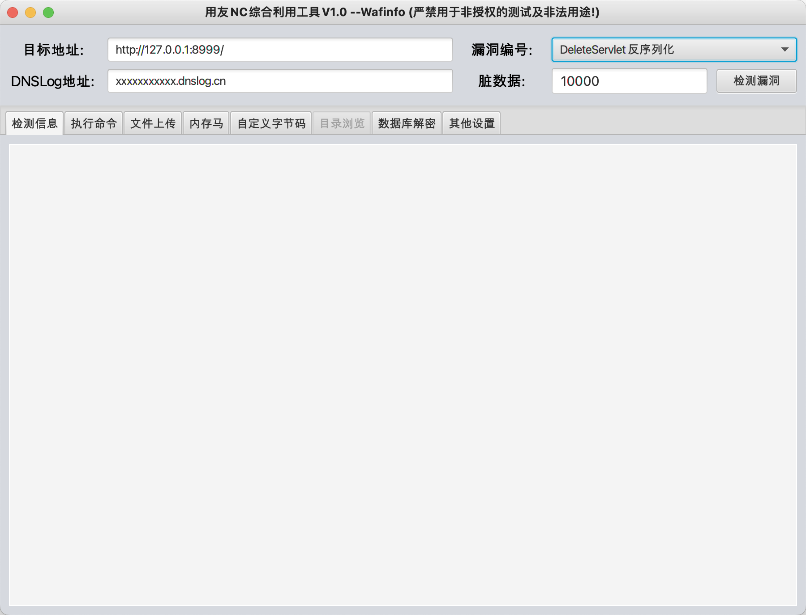

<h1 align="center" >NCTOOLs</h1>

<h3 align="center" >一款针对用友NC综合漏洞利用工具</h3>


##  👮🏻‍♀️ 免责声明

由于传播、利用NCTOOLs工具提供的功能而造成的**任何直接或者间接的后果及损失**，均由使用者本人负责，本人**不为此承担任何责任**。

### 支持检测漏洞列表：

```
BshServlet rce
jsInvoke rce
accept.jsp 文件上传
NCFindWeb 文件读取/列目录
DeleteServlet 反序列化
DownloadServlet 反序列化
FileReceiveServlet 反序列化
fsDownloadServlet 反序列化
MonitorServlet 反序列化
MxServlet 反序列化
UploadServlet 反序列化
NCMessageServlet 反序列化
XbrlPersistenceServlet 反序列化
ActionHandlerServlet 反序列化
ECFileManagerServlet 反序列化
ModelHandleServlet 反序列化
ResourceManagerServlet 反序列化
```

#### UI特色介绍：

当选择不同**漏洞类型**的时候，**UI**会自动**隐藏**不适合该**漏洞功能**，**显示**适合的**漏洞功能**。



## 👑 更新记录

- v1.0 2023/11/27

  正式版上线

